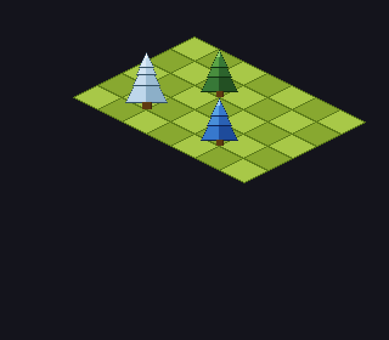
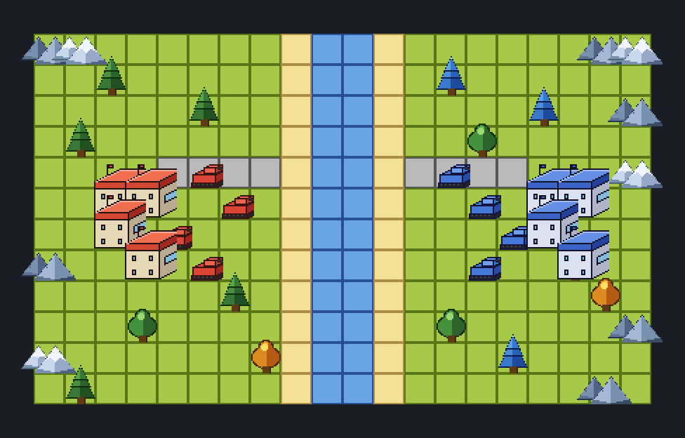

# isoart

Isometric pixel-art asset library for Python. Draw iso-grid or top-down tile scenes with sprites and export them as PNG images.



## Gallery

An AW-inspired battle map generated entirely with the library (top-down terrain + iso sprites):



Run it yourself: `python examples/aw_dogfights.py`.

## Install

```bash
pip install isoart
```

Requires Python 3.13+ and depends only on [Pillow](https://python-pillow.org/) and [NumPy](https://numpy.org/).

## Quick start

```python
from isoart import AW_BLUE_PINE, AW_PINE, AW_SNOW_PINE, IsoCanvas, PineTree

COLS, ROWS = 7, 5
TILE_W, TILE_H = 40, 20

canvas_w = (COLS + ROWS) * TILE_W // 2 + 80
canvas_h = (COLS + ROWS) * TILE_H // 2 + 160
origin = (canvas_w // 2, TILE_H * 2)

canvas = IsoCanvas(canvas_w, canvas_h, bg_color=(20, 20, 28, 255),
                   tile_w=TILE_W, tile_h=TILE_H, origin=origin)

canvas.draw_grid(COLS, ROWS)

trees = [
    (PineTree(tier_count=3, tier_size=28, palette=AW_PINE),      2, 1),
    (PineTree(tier_count=3, tier_size=28, palette=AW_BLUE_PINE), 4, 3),
    (PineTree(tier_count=4, tier_size=32, palette=AW_SNOW_PINE), 1, 3),
]

for tree, gx, gy in trees:
    canvas.draw(tree, gx, gy)

canvas.save("demo.png", scale=2)
```

## API

Two canvas classes are provided:

- `IsoCanvas` — classic 2:1 isometric diamond tiles (e.g. simcity/rpg look).
- `TopDownCanvas` — flat square tiles with iso-perspective sprites on top (AW battle-map look).

Sprites, palettes, and multi-terrain maps work with both.

### `IsoCanvas`

Isometric diamond-tile drawing surface.

```python
IsoCanvas(
    width: int,
    height: int,
    bg_color: tuple[int, int, int, int] = (0, 0, 0, 0),  # RGBA, default transparent
    tile_w: int = 32,
    tile_h: int = 16,
    origin: tuple[int, int] | None = None,  # defaults to top-center
)
```

| Method | Description |
|--------|-------------|
| `draw_grid(cols, rows)` | Draw a checkerboard diamond-tile grid (all grass) |
| `draw_tile(tile_type, gx, gy)` | Paint a single diamond tile of a given `TerrainType` |
| `draw_map(tiles)` | Paint a 2-D `list[list[TerrainType]]` map |
| `draw(sprite, gx, gy, gz=0)` | Place a sprite at grid coordinates |
| `save(path, scale=1)` | Save as PNG, optionally upscaled with nearest-neighbour |
| `get_image()` | Return the underlying `PIL.Image` |

### `TopDownCanvas`

Flat square-tile drawing surface. Terrain renders orthogonally; sprites still use their iso geometry and anchor at the tile's centre-bottom.

```python
TopDownCanvas(
    width: int,
    height: int,
    bg_color: tuple[int, int, int, int] = (0, 0, 0, 0),
    tile_size: int = 24,
    origin: tuple[int, int] = (0, 0),
)
```

Methods mirror `IsoCanvas`: `draw_tile`, `draw_map`, `draw`, `save`, `get_image`.

### Terrain tiles

```python
from isoart import TerrainType

# Any of: TerrainType.GRASS, WATER, BEACH, ROAD
tiles = [
    [TerrainType.GRASS, TerrainType.BEACH, TerrainType.WATER],
    [TerrainType.ROAD,  TerrainType.GRASS, TerrainType.BEACH],
]
canvas.draw_map(tiles)
```

Each tile paints a light/dark checker variation of its palette plus an outline.

### Sprites

**`PineTree`** — layered Christmas-tree silhouette.

```python
PineTree(
    tier_count: int = 3,   # number of foliage tiers
    tier_size: int = 30,   # pixel width of the widest tier
    palette: dict = AW_PINE,
    outline_width: int = 1,
)
```

**`RoundTree`** — deciduous tree with rounded dome tiers.

```python
RoundTree(
    tier_count: int = 3,
    tier_size: int = 28,
    palette: dict = AW_ROUND_TREE,
)
```

**`Mountain`** — two rounded rocky humps side by side.

```python
Mountain(
    size: int = 28,        # pixel width of the front hump (sprite is ~2× wider)
    palette: dict = AW_MOUNTAIN,
)
```

**`House`** — chunky iso cube with a flat roof slab, windows, and a rooftop flag.

```python
House(
    width: int = 24,
    depth: int = 18,
    wall_h: int = 20,
    roof_h: int = 5,
    palette: dict = AW_HOUSE_NEUTRAL,
)
```

**`Tank`** — iso pixel-art tank with tread platform, body, turret, and barrel.

```python
Tank(
    palette: dict = AW_TANK_RED,
)
```

### Palettes

| Constant | Used with | Style |
|----------|-----------|-------|
| `AW_PINE` | `PineTree` | Classic green pine |
| `AW_BLUE_PINE` | `PineTree` | Cold blue-green pine |
| `AW_SNOW_PINE` | `PineTree` | Snow-capped pine |
| `AW_ROUND_TREE` | `RoundTree` | Green deciduous |
| `AW_AUTUMN_TREE` | `RoundTree` | Orange/yellow autumn |
| `AW_BLUE_ROUND_TREE` | `RoundTree` | Blue faction tint |
| `AW_MOUNTAIN` | `Mountain` | Grey rock |
| `AW_MOUNTAIN_SNOW` | `Mountain` | Snow-capped rock |
| `AW_HOUSE_RED` | `House` | Red roof |
| `AW_HOUSE_BLUE` | `House` | Blue roof |
| `AW_HOUSE_NEUTRAL` | `House` | Tan roof |
| `AW_TANK_RED` | `Tank` | Red faction unit |
| `AW_TANK_BLUE` | `Tank` | Blue faction unit |

See `samples/` for a rendered PNG of each variant.

### Transform utilities

```python
from isoart import world_to_screen, screen_to_world, tile_diamond

# Convert grid coords to screen pixels
sx, sy = world_to_screen(gx, gy, gz, tile_w, tile_h)

# Convert screen pixels to grid coords
gx, gy = screen_to_world(sx, sy, tile_w, tile_h)

# Get the four corner vertices of a diamond tile (for polygon drawing)
verts = tile_diamond(gx, gy, tile_w, tile_h, origin)
```

## Development

```bash
uv sync          # install all dependencies including dev
pytest           # run tests
ruff check       # lint
uv build         # produce wheel + sdist in dist/
```

## License

MIT — see [LICENSE](LICENSE).
